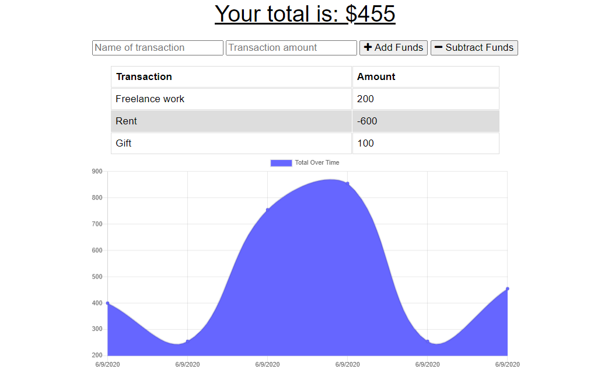

# Budget Tracker

## Description

The goal for this project is to update an existing budget tracker application to allow for offline access and functionality. The user will be able to add expenses and deposits to their budget with or without an internet connection. If the user enters transactions offline, the total should be updated when they are brought back online.

I have also added a web manifest to this application with the app’s metadata, to let users’ mobile devices know what they’re installing and how the app should look on the home screen.

## Table of Contents

* [Description](#description)
* [Table of Contents](#table-of-contents)
* [Technologies](#technologies)
* [Tasks List](#tasks-list)
* [Usage and Test](#usage-and-tests)
* [License](#license)
* [Contributing](#contributing)
* [Screenshot](#screenshots)
* [Deploye Application](#deployed-application)
* [Questions](#questions)

## Technologies

* Express.js
* MongoDB
* Mongoose
* Service workers
* Web Manifest
* JavaScript
* HTML
* CSS

## Tasks List

- [x] When the user inputs an expense or deposit, then they will receive a notification that they have added an expense or deposit.
- [x] When the user reestablishes an internet connection, then the deposits or expenses added while they were offline are added to their transaction history and their totals are updated.

## Usage and Tests

You can view this application using the following link: [Deployed App](https://budget-tracker-521.herokuapp.com/)

To test the application performance follow these steps:

* To check if this application works in an offline mode, open "Chrome DevTools" and click on the "Network" tab. Find "Throttling" drop-down, and select "Offline". Now try adding and subtracting funds through the application. Cashes of the browser and IndexedDB allow us to use this application without network connectivity.

* You can install the application on your desktop or mobile device by following these steps:
    1. At the top right of the address bar, click install "+".
    2. Follow the onscreen instructions to intall PWA.

## License

[MIT](https://choosealicense.com/licenses/mit/)

## Contributing

Pull requests are welcome. For major changes, please first open an issue to discuss what you would like to change.

## Screenshot

Please see below for the screenshot of homepage:

## Deployed Application

Please use the following link to view the deployed application on heroku: [Deployed App](https://budget-tracker-521.herokuapp.com/)

## Questions

If you have any questions please use the following two links to contact me:

* [GitHub](https://github.com/sshahram)

* [Email Address](mailto:shirin.shahram23@gmail.com)